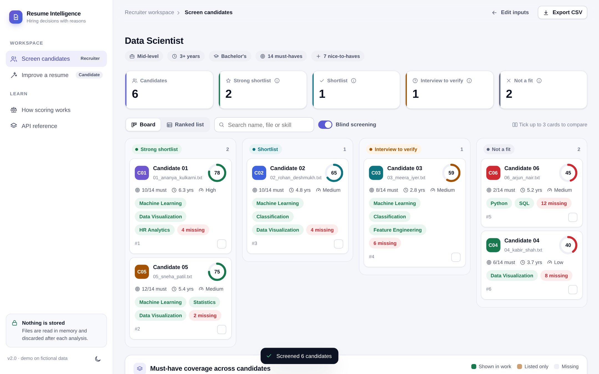
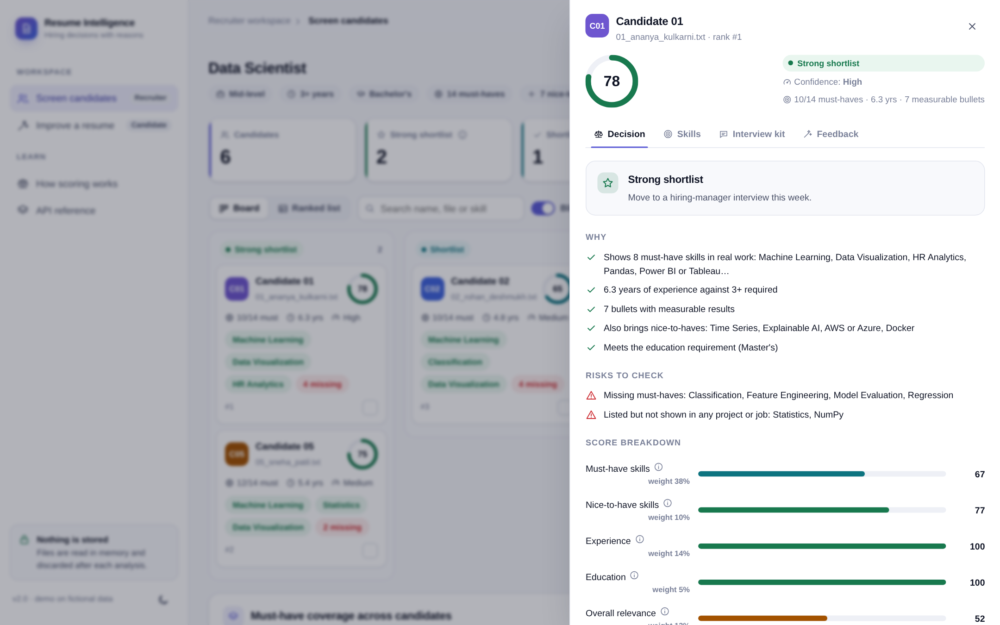
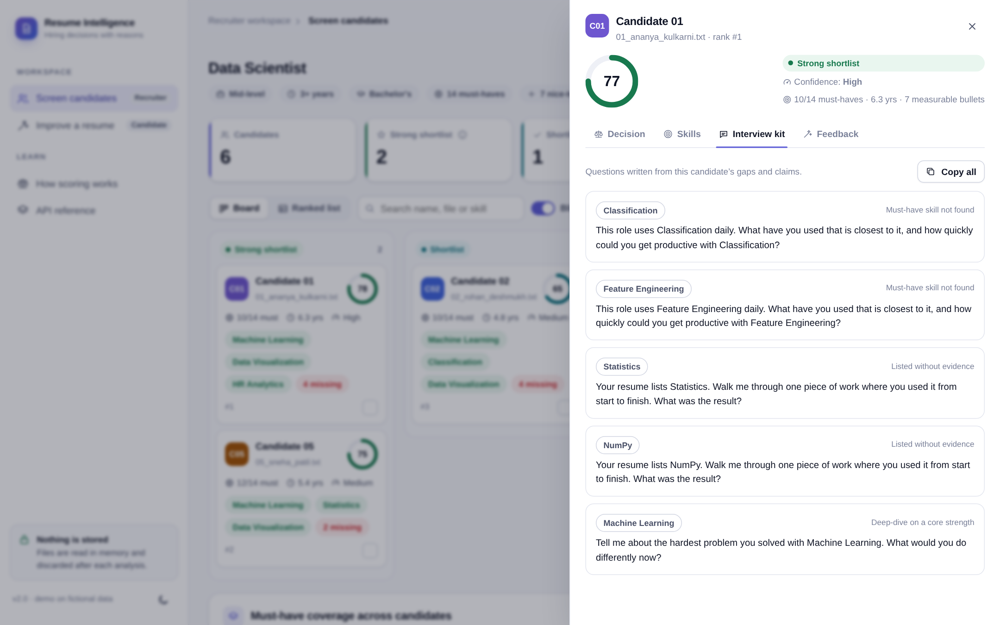
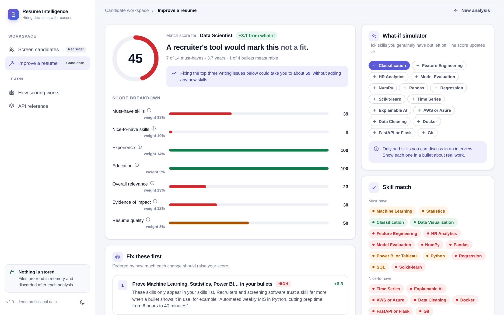
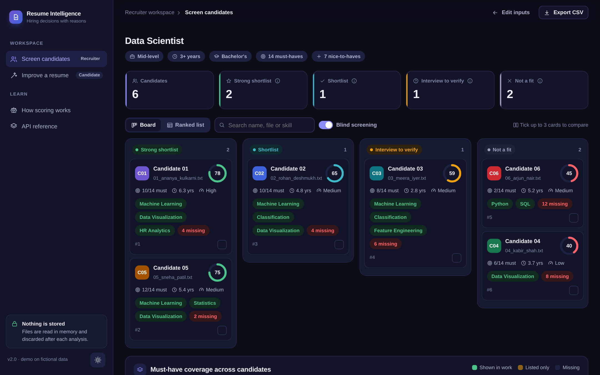

# Resume Intelligence

**Explainable resume screening for recruiters, and honest resume coaching for candidates.**

**Live demo: [resume-intelligence-hg1g.onrender.com](https://resume-intelligence-hg1g.onrender.com)**: click *Try with sample data*, no signup. (Free hosting: the first load can take 30–60 seconds.)

[](https://github.com/OmkarG-Star/AI-resume-analyzer/actions/workflows/ci.yml)


Most "resume analyzers" return one similarity percentage. Recruiters cannot act on a number, and candidates cannot fix one.
This tool returns **a decision with reasons**: who to shortlist, why, what to check in the interview, and, for candidates,
exactly which changes raise their score and by how much.



| Candidate decision | Interview kit |
|---|---|
|  |  |
| **Candidate mode** | **Dark theme** |
|  |  |

*All people, companies and resumes in the demo are fictional.*

---

## Two workspaces

### Recruiter: screen candidates
- Upload a job description and up to 50 resumes (**PDF, DOCX, TXT**).
- Every candidate gets a verdict: **Strong shortlist · Shortlist · Interview to verify · Not a fit**, with the knockout rules that triggered it.
- **Why** and **Risks to check** in plain sentences, plus a 7-part score breakdown.
- **Interview kit**: questions written from that person's gaps ("Your resume lists Tableau but no project shows it…").
- **Candidate feedback** you can paste into a reply, whatever the decision.
- **Board** (Kanban by verdict) or **ranked list**, search, **compare up to 3** side by side, **CSV export**.
- **Must-have coverage heatmap** across the pool: if nobody has a skill, the requirement may be unrealistic.
- **Blind screening on by default**: names are replaced by candidate IDs.

### Candidate: improve a resume
- Match score for a specific job, and how a recruiter's tool would classify you.
- **Fix these first**: changes ranked by their measured score gain.
- **Bullet rewrites** that turn "Responsible for preparing reports" into "Prepared reports — [add the result]", with placeholders instead of made-up numbers.
- **What-if simulator**: tick skills you genuinely have but left off and watch the score update.
- Job keywords you don't use, an ATS readiness checklist, and a skill match map.

---

## How the score works

| Part | Weight | What it measures |
|---|---|---|
| Must-have skills | 38 | Share of required skills found. **Shown in a job/project bullet = full credit; only in a skills list = 70%.** |
| Experience | 14 | Years from dated roles (overlaps merged) vs the job's minimum |
| Overall relevance | 13 | TF-IDF cosine similarity between resume and job (1–2 grams) |
| Evidence of impact | 12 | Measurable results, action-verb bullets, skills demonstrated in context |
| Nice-to-have skills | 10 | Same as must-haves, for preferred skills |
| Resume quality | 8 | Contact details, standard sections, length, measurable bullets |
| Education | 5 | Highest level found vs required level |

Parts that don't apply (e.g. no education requirement) are dropped and the rest re-weighted.

**Reading the job.** Skills under *Requirements* are must-haves. Skills under *Nice to have*, or in sentences with "preferred", "bonus" or "a plus", are nice-to-haves. Skills that appear only in the duties count as nice-to-haves when the advert has an explicit requirements list. **"Power BI or Tableau" is one requirement**: either skill satisfies it.

**Skills.** 96 canonical skills with 259 aliases across 9 categories (sklearn → Scikit-learn, Postgres → PostgreSQL), matched on token boundaries so "excellent" is not "Excel" and "mysql" is not "sql". Specific tools imply broader skills (PostgreSQL → SQL, PyTorch → Deep Learning).

**Verdicts.**

| Verdict | Rule |
|---|---|
| Strong shortlist | Score ≥ 74, at most 30% of must-haves missing, experience met |
| Shortlist | Score ≥ 62, at most a third of must-haves missing |
| Interview to verify | Score ≥ 48 |
| Not a fit | More than half the must-haves missing, or score < 48 |

**Gains are measured, not guessed.** Each suggestion's "+points" comes from re-scoring the resume with that one fix applied.

---

## Responsible use

- **Decision support, not a decision.** Keyword-based scoring misses career changers, unusual titles and context. A person should review every rejection.
- **No personal attributes.** Name, gender, age, photo and address are never used. Blind mode hides names, and emails and phone numbers are masked in any quoted text.
- **Nothing is stored.** Uploads are processed in memory and discarded. There is no database and no logging of resume content.
- **Honest coaching.** The candidate view never suggests claiming skills you don't have, and rewrites use placeholders rather than invented numbers.

---

## Architecture

```
frontend/            single-page app: vanilla JS, hand-built SVG, no framework or CDN
  index.html
  assets/app.js      routing, views, drawer, compare, what-if, uploads
  assets/styles.css  design tokens (light/dark), components, motion
  assets/icons.js    outline icon set drawn for this project (MIT)
src/resume_ai/
  parsing.py         PDF/DOCX/TXT extraction, sections, years, education, PII masking
  skills.py          taxonomy, aliases, implications, span matching
  jd.py              must-have / nice-to-have split, either-or groups, years, education, seniority
  engine.py          features, 7-part score, verdicts, reasons, questions, suggestions, rewrites
  api.py             FastAPI: /api/analyze, /api/screen, /api/screen/export, /api/parse-file
samples/             2 job descriptions and 6 fictional resumes
tests/               27 pytest tests (parsing, skills, JD, engine, API incl. PDF/DOCX upload)
legacy/              the original Streamlit + TF-IDF version, kept for comparison
```

## Run it

```bash
git clone https://github.com/OmkarG-Star/AI-resume-analyzer.git
cd ai-resume-analyzer
pip install -r requirements.txt
PYTHONPATH=src uvicorn resume_ai.api:app --reload
# open http://localhost:8000  ·  API docs at /api/docs
```

Tests:

```bash
pip install pytest httpx reportlab
python -m pytest -q
```

Docker:

```bash
docker build -t resume-intelligence .
docker run -p 8000:8000 resume-intelligence
```

Deploy for free on Render: **New → Blueprint →** select this repo (`render.yaml` is included).

## API

```bash
curl -X POST localhost:8000/api/analyze -H 'content-type: application/json' \
  -d '{"resume": "…resume text…", "job": "…job description…", "assume_skills": ["Pandas"]}'
```

| Endpoint | Purpose |
|---|---|
| `POST /api/analyze` | One resume vs one job: score, verdict, suggestions, rewrites, ATS checks |
| `POST /api/screen` | Many resumes vs one job: ranked candidates, counts, skill coverage |
| `POST /api/screen/export` | The ranked shortlist as CSV |
| `POST /api/parse-file` | Extract text from a PDF, DOCX or TXT upload |
| `GET /api/samples` | Demo job descriptions and resumes |

## Version history

- **v2.0**: rebuilt as a two-sided product: structured job parsing, evidence-weighted scoring, verdicts with reasons, interview kit, candidate coaching with measured gains, premium web UI, tests and CI.
- **v1.0** (`legacy/`): Streamlit app with TF-IDF cosine similarity and a fixed 28-skill list.

## License

MIT © 2026 Omkar Gadhave
